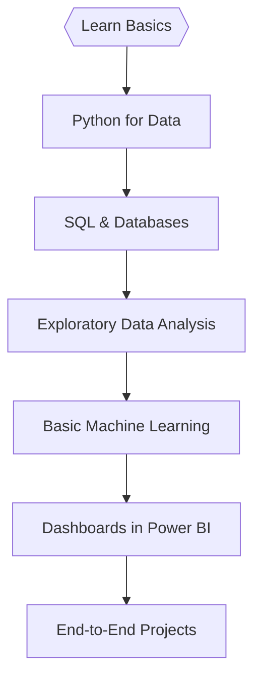

  

<h1 align="center">Hi, I'm Shubham Singh Shekhawat! 👋</h1>

  <b>🚀 Data Science</b> &nbsp;|&nbsp; <b>📈 Aspiring Data Analyst</b> &nbsp;|&nbsp; <b>🧠 Python & Power BI</b>

---

## 🧬 My Tech Story: Automating + Innovating Across Stacks

- *Data Science Mindset*: I love turning raw, messy data into insights using Python, Pandas, NumPy, and ML models.
- *ML Explorer*: Always experimenting with algorithms — classification, clustering, forecasting — and learning how to improve real-world predictions.
- *Analytical Thinking*: I break down complex problems into simple, logical, and workable solutions.
- *Curiosity Driven*: If data exists, I want to analyze it. If patterns exist, I want to find them.

---

## 💡 Toolbox of the Modern Era

 
  <!-- DevOps --> 

   
  <!-- Data Science --> 
       
  <!-- Others --> 
 

---

## ⚡ Highlight Reel

- Turned 15+ boring deployments into single-click magic 🎩.
- Tamed microservices and tamed data pipelines (almost never at the same time).
- Cat-wrangled YAML, Dockerfiles, and the occasional ML model, with infra that just won’t quit.
- Made monitoring fun (with slick dashboards, alert memes, and lots of automation).
- My mantra: **If I can automate it, I will. If not, I learn how.**

---

## 🔥 GitHub Dashboard — Fully Animated

  
  
   
  

---

### ⚡ Automation Fun Facts

> "Did you know? The first DevOps engineer probably automated making coffee alongside deploys. I like to think my pipelines do both."
>
> "Fact: Every data scientist spends 80% of their time cleaning data. The other 20%? Automating the cleaning for next time."
>
> "When my pipelines break, I call it 'creative chaos.' It's just automation asking for attention."
>
> "My favorite deployment status: 'Success after one tiny fix.' That fix? Usually a missing semicolon."
>
> "The best pipeline is like a good joke—if you have to explain it, you should probably rewrite it."

---

## ⚙️ Current Lab Experiments

- Building versatile, self-healing DevOps pipelines
- Architecting cloud infrastructure for flexible ML model deployment
- Data wrangling & exploratory ML in Python (sometimes with pizza)
- Researching MLOps edge cases (and memes for fun)

---

## 📡 Connect With Me

  
  

---

## 🌈 Final Thought

> Pipelines are like puzzles; ML is like magic.  
> Every new tool is a party, and every new problem is an invitation.  
> Trying to make tech more fun, fast, and fail-proof—one commit at a time.

---

  
   
  <i>Modern DevOps + DataScience by Shubham Saini</i>

